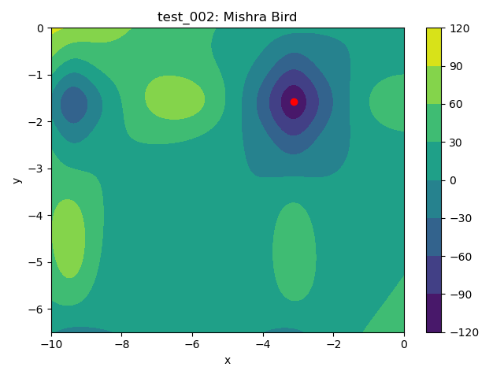

# SQP Solver
Basic/minimal sequential quadratic programming (SQP) solver based on https://github.com/msplr/sqp_solver.

# Tests

 Plot | Test Problem | Minimum 
:----:|:--------:|:-------:
 | $`f(x,y) = (1 - x)^2 + 100(y - x^2)^2`$ subject to $`x^2 + y^2 \leq 2`$, $`-1.5 \leq x \leq 1.5`$, and $`-1.5 \leq y \leq 1.5`$ | $`(1.0, 1.0)`$
 | $`f(x,y) = sin(y)e^{(1 - cos(x))^2} + cos(x)e^{(1 - sin(y))^2} + (x - y)^2`$ subject to $`(x + 5)^2 + (y + 5)^2 \leq 25`$, $`-10.0 \leq x \leq 0.0`$, and $`-6.5 \leq y \leq 0.0`$ | $`(-3.1302468, -1.5821422)`$