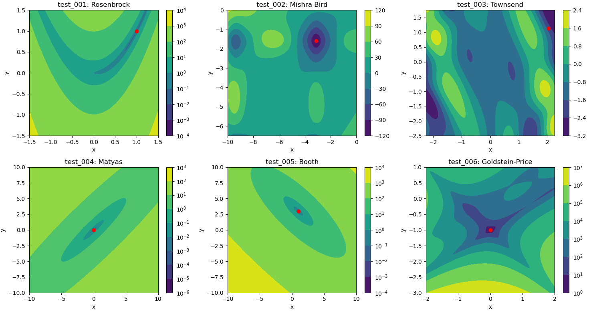

# SQP Solver
Basic/minimal sequential quadratic programming (SQP) solver based on https://github.com/msplr/sqp_solver.

# Tests
Examples were pulled from https://en.wikipedia.org/wiki/Test_functions_for_optimization:

1. Rosenbrock function constrained to a disk, w/ box constraints
2. Mishra's Bird function constrained to a disk, w/ box constraints
3. Modified Townsend function constrained to a heart, w/ box constraints
4. Matyas function, w/ box constraints
5. Booth function, w/ box constraints
6. Goldstein-Price function, w/ box constraints

