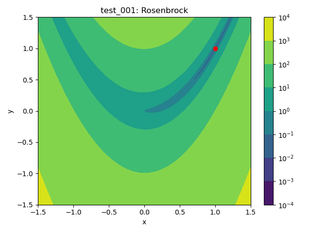

# SQP Solver
Basic/minimal sequential quadratic programming (SQP) solver based on https://github.com/msplr/sqp_solver.

# Tests

 Plot | Test Problem | Minimum 
:----:|:--------:|:-------:
 | $`f(x,y) = (1 - x)^2 + 100(y - x^2)^2`$ subject to $`x^2 + y^2 \leq 2`$, $`-1.5 \leq x \leq 1.5`$, and $`-1.5 \leq y \leq 1.5`$ | $`(1.0, 1.0)`$
